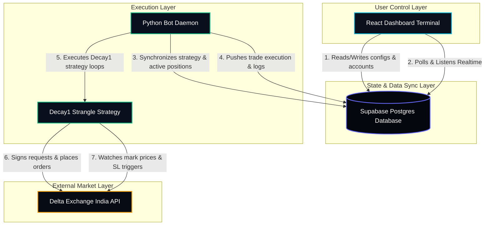
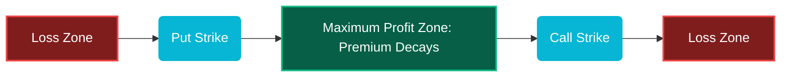

# High-Level Design (HLD): DeltaTrade Option Strangle Desk

This document explains the overall architecture, data flows, and system components of the **DeltaTrade Automated Strangle Desk**. It is written to be easily understood, using diagrams to illustrate how the parts work together.

---

## 1. System Architecture Overview

DeltaTrade consists of three primary layers that work together to execute and monitor automated strangle options:

1.  **React + Tailwind v4 Dashboard**: The control terminal where you view live strangles, manage trading accounts, configure parameters, and review system execution logs.
2.  **Supabase PostgreSQL Database**: The centralized database and real-time state synchronizer. It connects the frontend terminal to the backend execution bot instantly using real-time database listener channels.
3.  **Python Bot Scheduler Daemon**: The background engine. It runs continuously, schedules trade entries and exits based on IST timezones, monitors stop-losses, and communicates directly with the **Delta Exchange India V2 API**.

Here is a simplified flowchart of how these three layers interact:

---

## 2. The Strangle Option Strategy (Decay1)

The primary automated strategy running on the desk is **Decay1**. It is a **Short Strangle** premium decay strategy.

### What is a Short Strangle?
A Short Strangle involves selling two out-of-the-money (OTM) options contracts simultaneously on the same underlying asset (e.g. BTC):
1.  **Short Call Option**: Selling an option at a higher strike price than the current spot price.
2.  **Short Put Option**: Selling an option at a lower strike price than the current spot price.

By selling both options, you collect **premium** (cash value). As time passes throughout the day, option premiums naturally decay (lose value), assuming the underlying asset stays relatively stable. The bot will buy back the options at a cheaper price (or let them expire worthlessly) to secure a profit.

Here is a visual payoff diagram illustrating the strangle range:

### Risk Controls
*   **Dynamic Strike Selection (OTM1 to OTM6)**: The bot allows users to dynamically configure the option strike selection from the dashboard. OTM1 offers high liquidity and premiums, while OTM6 offers deeper out-of-the-money targets.
*   **Python-Managed leg-wise Stop Loss**: Stop-loss risk is managed entirely by the local Python background daemon using live **`best_ask`** market prices (since closing short options requires buying them back at the ask premium). If `best_ask >= sl_price`, the bot immediately fires a market buy order to close the leg, bypassing slow or rigid exchange-native triggers.
*   **Underlying Spot Target (Decay 1)**: If the price of the underlying asset (BTC spot) moves past the configured target percentage in either direction from the initial strangle entry level, the bot immediately triggers a market close for that specific leg.
*   **Joint Exit Protection (Decay 2)**: If either strangle leg is hit (Stop Loss or Take Profit), the bot immediately triggers a joint exit to square off the remaining leg at market, neutralizing active portfolio risk.

---

## 3. Daily Execution Timeline (IST Timezone)

The strategy operates strictly as an **intraday** session based on dynamic schedules saved in your database:

```mermaid
gantt
    title Intraday Strangle Lifecycle
    dateFormat  HH:mm
    axisFormat %H:%M
    
    section Intraday Session
    Bot Scheduler Active           :active, 09:30, 16:30
    section Strategy Actions
    Fetch Tickers & Select Strike  :crit, 09:48, 09:49
    Execute Option Short Entries   :active, 09:49, 09:50
    Monitor best_ask Premium       :active, 09:50, 16:29
    Session Target/Time Exit       :crit, 16:29, 16:30
```

*   **Daemon Bootup**: The Python bot daemon starts up, queries Supabase to fetch custom IST entry/exit times, and schedules cron execution triggers dynamically.
*   **Strangle Entry (User Configured Time)**: The entry job triggers. The bot pulls live options chains, parses OTM strike contracts based on your active selection, registers entries in the database, and sends unbracketed short strangle orders to Delta Exchange India.
*   **Intraday Monitoring Loop**: A high-frequency background loop runs **every 10 seconds** to poll option **`best_ask`** premium spreads, verify stop-losses locally, and monitor spot targets dynamically.
*   **Scheduled Exit (User Configured Time)**: The time-exit job triggers. The bot buys back any remaining open options contracts at market price, completing the cycle.

---

## 4. Key Data Flows

### A. Automatic Position Monitoring Loop
1.  Every **10 seconds**, the Python bot fetches active positions marked `open` in the Supabase DB.
2.  The bot queries Delta Exchange live ticker quotes for those specific contracts.
3.  The bot calculates:
    *   **Current PnL**: `(Entry Price - Mark Price) * size`.
    *   **Decay Value**: `(Entry Price - Mark Price) / Entry Price * 100`.
4.  The bot updates the `positions` table in the database with the latest mark prices and PnL metrics.
5.  The Supabase realtime channel broadcasts the update.
6.  The React dashboard receives the broadcast and instantly updates the performance metrics and **Premium Decay Progress Bar** with zero manual refreshes.

### B. Dashboard Manual Close Sequence (Double Exit)
1.  The user clicks **Square Off Strangle (Both Legs)** on the dashboard.
2.  The dashboard updates both positions' status fields in Supabase to `close_requested`.
3.  The Python monitoring loop detects the `close_requested` state within 10 seconds.
4.  The bot dispatches market buy orders to Delta Exchange to buy back both options.
5.  Upon successful fills, the bot marks the positions as `closed` in Supabase and adds execution transaction logs.
6.  The dashboard receives the update, displays a green **success toast**, and clears the Active Strangles board automatically.
