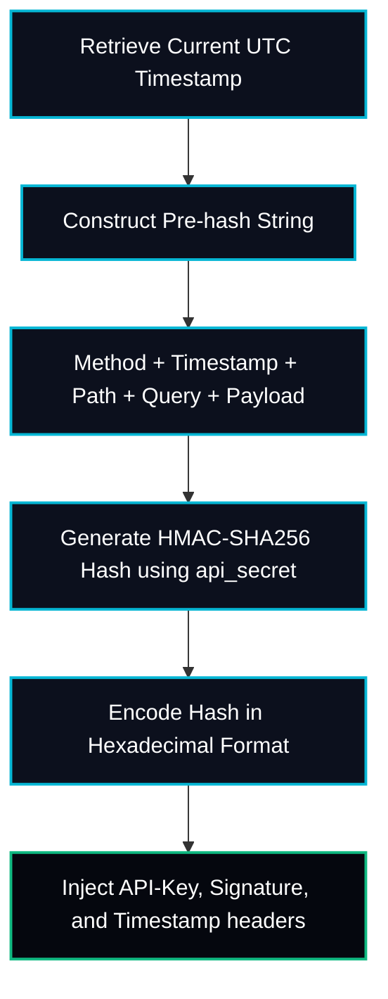
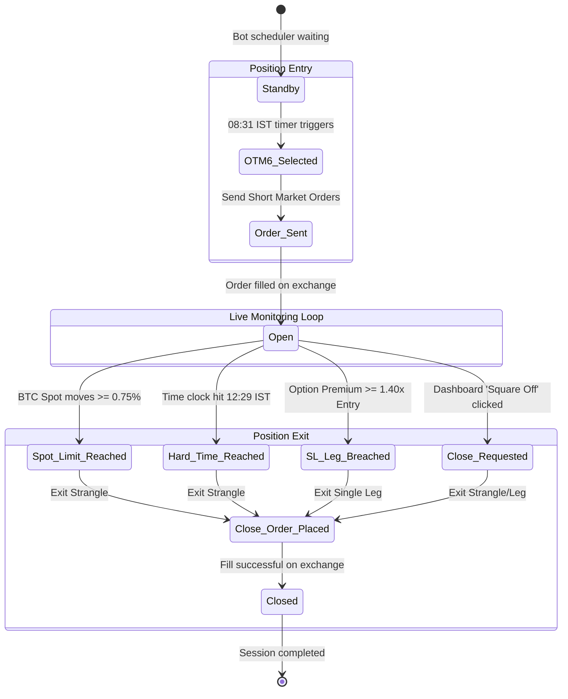

# Low-Level Design (LLD): DeltaTrade Option Strangle Desk

This document provides technical details of the codebase, database schemas, cryptographic signing procedures, and state-machine transitions of the **DeltaTrade** system.

---

## 1. Database Model & Schema Specifications

The Supabase PostgreSQL database serves as the persistent database and synchronization layer. The tables are configured with references and indices to ensure fast queries.

### Entity Relationship Model

```mermaid
erDiagram
    ACCOUNTS ||--o{ POSITIONS : "has active"
    ACCOUNTS ||--o{ PNL_HISTORY : "tracks yield"
    STRATEGIES {
        uuid id
        string name UNIQUE
        string description
        string underlying
        time entry_time_ist
        time exit_time_ist
        string strike_selection
        numeric sl_multiplier
        numeric underlying_target_pct
        boolean is_active
    }
    ACCOUNTS {
        uuid id
        string name UNIQUE
        string api_key
        string api_secret
        string env
        boolean is_active
    }
    POSITIONS {
        uuid id
        uuid account_id FK
        string strategy_name
        string symbol
        string side
        bigint product_id
        integer size
        numeric entry_price
        numeric mark_price
        numeric sl_price
        numeric tp_price
        numeric pnl
        string status
        bigint entry_order_id
        timestamp created_at
        timestamp closed_at
    }
    TRADE_LOGS {
        uuid id
        string account_name
        string strategy_name
        string message
        string log_level
        timestamp created_at
    }
    PNL_HISTORY {
        uuid id
        uuid account_id FK
        date date
        numeric realized_pnl
        numeric total_fees
    }
```

---

## 2. Option Symbology Parsing & Contract Selection

Option tickers are parsed inside `strategy_decay1.py` to identify option type, underlying asset, strike price, and expiry dates.

*   **Symbology Pattern**: `Type-Asset-Strike-Expiry` (e.g. `C-BTC-90000-310125` or `P-BTC-88000-310125`)
    *   `parts[0]` = Contract type (`C` for Call, `P` for Put)
    *   `parts[1]` = Underlying asset (`BTC`)
    *   `parts[2]` = Strike price (`90000`)
    *   `parts[3]` = Expiry date in `ddmmyy` format (`310125` = 31st January 2025)

### Strike Selection Logic (OTM6)
1.  The bot queries all active options contracts for the target asset.
2.  Filters out contracts that do not match the current date's expiry.
3.  Sorts all Call options by strike price in ascending order.
4.  Sorts all Put options by strike price in descending order.
5.  Locates the ATM (At-The-Money) contract closest to the current underlying spot price.
6.  Selects:
    *   **Call Contract**: The contract **6 positions above** the ATM contract in the sorted array.
    *   **Put Contract**: The contract **6 positions below** the ATM contract in the sorted array.

---

## 3. Cryptographic Signature Generation (Delta V2 API)

Delta Exchange India V2 API enforces strict authentication using **HMAC-SHA256 signature signing**. All requests must carry signature headers valid for a **5-second window** to prevent replay attacks.

### Signature Formula
The signature is generated by hashing the HTTP method, path, query parameters (if any), a timestamp, and the request payload (if any) with the account's private `api_secret`:

$$\text{Signature} = \text{HMAC-SHA256}\Big(\text{api\_secret}, \ \text{method} + \text{timestamp} + \text{path} + \text{query\_params} + \text{payload}\Big)$$

### Technical Signing Flow


### Signature Parameters Code Representation
```python
# python implementation in delta_client.py
import time
import hmac
import hashlib

timestamp = str(int(time.time()))
path = "/v2/orders"
payload = '{"product_id":12345,"size":10,"side":"sell","order_type":"market"}'
message = "POST" + timestamp + path + payload

signature = hmac.new(
    api_secret.encode('utf-8'),
    message.encode('utf-8'),
    hashlib.sha256
).hexdigest()
```

---

## 4. Position State-Machine Lifecycle

Positions transition through structured states to coordinate manual user overrides from the React dashboard with the background Python execution bot.



### State-to-State Database Mappings
1.  **Dashboard Emergency Request**: When a user clicks "Square Off", the dashboard updates `positions.status` from `'open'` to `'close_requested'` and registers a log in the database.
2.  **Daemon Interception**: The 10-second background monitor thread queries for positions matching `.in_('status', ['open', 'close_requested'])`.
3.  **Daemon Exit Execution**: If a position's status is `'close_requested'`, the daemon ignores price triggers, immediately signs a market-buy request to buy back the option contract, updates the position state to `'closed'`, and sets `closed_at = now()`.

---

## 5. Defensive Programming & Error Safeguards

### A. Sandbox quote fallback (Null Price Wrangler)
On Delta Exchange Testnet/Sandbox platforms, order books are occasionally inactive, returning `null` values for bids, asks, or mark prices.
*   **Safe Float Helper**: To prevent numeric conversion crashes, the system uses a safe float wrapper globally. Any `None` or parsing exception is safely redirected to `0.0`, allowing loops to continue executing without crashing.
```python
def safe_float(val) -> float:
    try:
        return float(val) if val is not None else 0.0
    except (ValueError, TypeError):
        return 0.0
```

### B. Clock Drift Prevention
Delta Exchange enforces a strict signature timeout. If the host computer running the Python bot daemon experiences clock drift (even by a few seconds), the API returns `expired_signature` errors.
*   **Mitigation**: The system synchronizes the Windows host time periodically using NTP synchronization routines against Microsoft NTP servers:
```powershell
w32tm /config /syncfromflags:manual /manualpeerlist:time.windows.com
w32tm /config /update
w32tm /resync
```
This aligns the client clock to within milliseconds of the exchange execution server clock.
